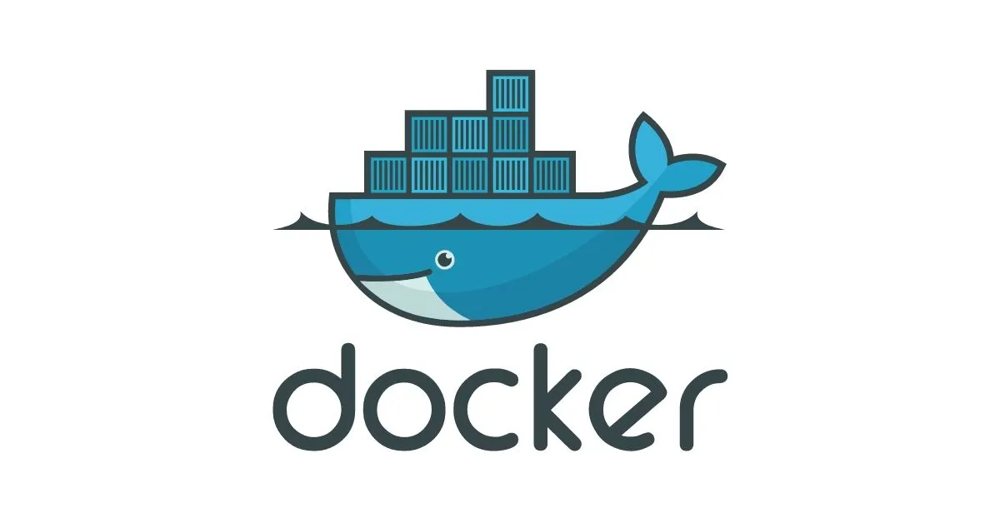

# 本篇重點

了解什麼是 Docker ， Docker 為我們帶來什麼好處解決什麼問題？用生活化的方式帶你理解容器化技術，無論你是新手還是老手都能快速理解， Docker 為你在開發上帶來的便利性。

<!-- more -->

## Docker 到底是什麼？

在軟體開發領域，大家或多或少都聽過 Docker。簡單來說，它是一種容器技術，用於創建和管理容器，讓應用程式更具可移植性並提升部署效率。等等，先別急！🤚 如果你對這句話還是不太理解，別擔心，接下來我會用生活化的例子來為你解釋。

## 什麼是容器？

在學習 Docker 之前，我們需要先了解什麼是容器，在軟體開發中，**容器**是一個標準化的軟體單元，它將應用程式及其運行環境打包在一起，確保應用程式在任何環境中都能以一致的方式執行，容器包含以下幾個關鍵元素：

- **應用程式原始碼**：應用程式的核心部分，所有的程式碼和邏輯。
- **運行代碼所需的依賴項**：這些是應用程式運行所需的函式庫、框架和其他工具。
- **執行應用程式的工具**：這些工具確保應用程式能夠在容器中順利運行。

容器的概念是為了解決**環境差異**問題，在傳統的開發流程中，應用程式在不同的環境（如開發、測試、生產）中可能會因為依賴項或配置的不同而產生不同的行為，容器將應用程式及其依賴項打包在一起，確保應用程式在任何環境中都能以相同的方式運行，從而提高開發和部署的可靠性與效率。

### 容器的優勢：

1. **一致性**：無論在開發、測試還是生產環境中，應用程式的行為都是一致的。
2. **隔離性**：容器之間相互隔離，確保一個容器的問題不會影響其他容器。
3. **可攜性**：容器可以在任何支援容器技術的平台上運行，無需擔心環境差異。
4. **資源效率**：與虛擬機相比，容器更輕量級，啟動速度更快，資源消耗更少。

通過使用容器，開發者可以更專注於應用程式的開發，而不必擔心環境配置的問題，提升開發效率和應用程式的穩定性。

## 舉一個使用容器的例子！

假設我們在開發一個 Node.js 應用程式，Node.js 是一個允許在伺服器上運行 JavaScript 程式碼的環境，如果我們將應用程式封裝到 Docker 容器內，那麼該容器會包含：

- 應用程式的原始碼
- Node.js 執行時
- 其他必要的工具與依賴

這樣，我們就能確保：

- 容器內的 Node.js 版本始終一致
- 執行環境固定，不會因系統不同而產生不一致行為
- 可在任何支援 Docker 的環境中運行，無需額外安裝依賴

## 容器的比喻：

如果你還是不太了解怎麼辦？沒關係，下面有兩個例子可以給你更好的理解容器是什麼。

### 1.野餐籃

(圖片取自網路)

想像一下你要去公園野餐，你準備了一個野餐籃，裡面裝滿了：

- 食物
- 餐具
- 杯子
- 其他需要的物品

無論你在哪裡打開這個野餐籃，裡面的東西都是一樣的，不會有任何驚喜，你甚至可以分享給朋友，確保他們可以享受到同樣的體驗。

容器的概念與此類似，它將所有應用程式運行所需的內容打包在一起，確保無論在哪裡執行，環境都是一致的。

### 2.貨櫃（集裝箱）

(圖片取自網路)

如果你聽到「容器」，你可能會想到運輸用的貨櫃（這也是為什麼 Docker 的 Logo 上有很多貨櫃箱）。

貨櫃有幾個特點：

- 標準化：可以裝載不同類型的貨物，但結構固定
- 獨立性：一個貨櫃的內容不會影響其他貨櫃
- 可移植性：貨櫃可以放到不同的船或卡車上運輸，而不受影響

Docker 容器也具備這些特性：

- 它是標準化的軟體包
- 它的執行環境是獨立的
- 它可以運行在任何支援 Docker 的地方

這樣，我們不需要額外安裝環境，也不用擔心依賴問題。

## Docker 的角色

Docker 其實就是一個工具，它簡化了容器的創建與管理。

- 現代作業系統內建對容器的支援，或能輕易安裝 Docker 來使用
- Docker 讓容器的建置、執行和管理變得簡單

## **結論**

Docker 讓應用程式能夠以容器的形式運行，確保環境的一致性、可移植性和獨立性。它的概念類似於野餐籃或貨櫃，將所有需要的東西打包好，無論在哪裡都能保證相同的執行結果。

# 延伸閱讀

- [Docker 官方文件 - What is Docker](https://docs.docker.com/get-started/docker-overview/)
