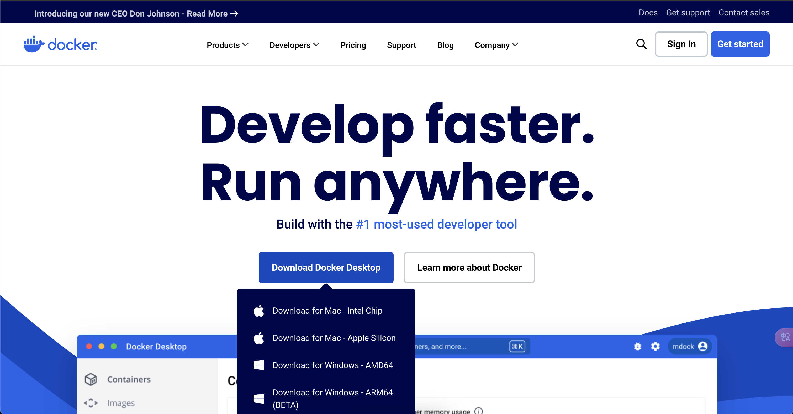
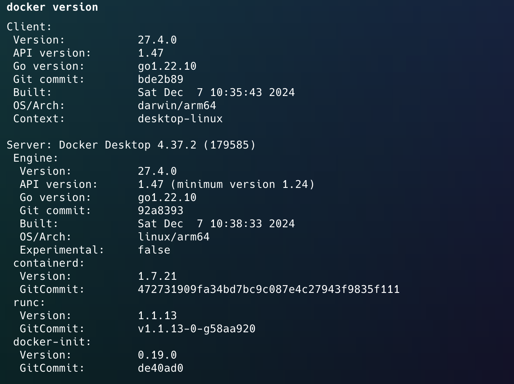
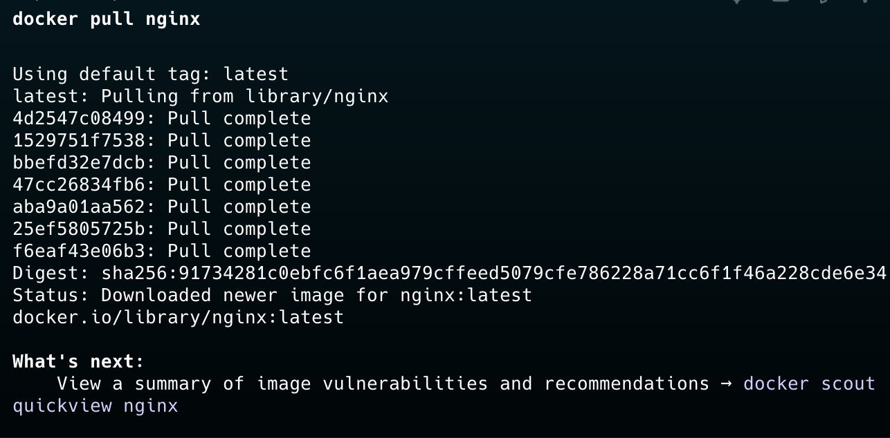
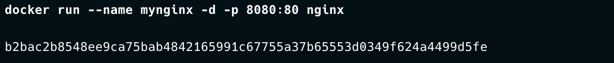
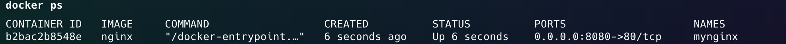
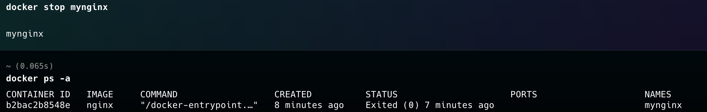
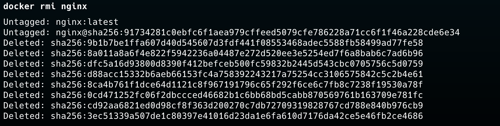
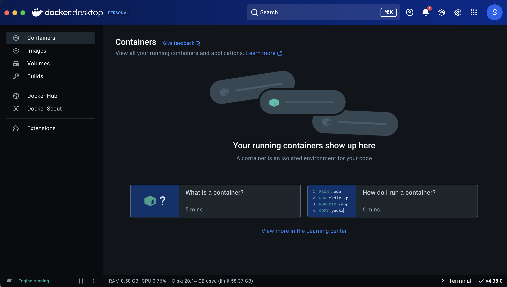

# 本篇重點

帶你從安裝 Docker 開始，並介紹一些基本的 Docker 操作指令，幫助你快速上手容器化技術。

<!-- more -->

## 怎麼安裝 Docker

在官網中有各種不同的版本，大家可以根據自己的環境需求來進行安裝。如果你在系統上無法順利安裝，可以先使用這個 [Play with Docker](https://labs.play-with-docker.com/) 來練習，但這裡還是建議大家都要去安裝 Docker 才能完整使用到所有功能。



## 怎麼檢查有沒有安裝成功？

在你安裝好後可以透過電腦的 cmd 來檢查 docker 的版本，圖中是 mac 版本的為例可能跟大家的畫面看起來不太一樣。

```bash
docker version
```



## 安裝後基本操作

| 指令                                       | 說明                           |
| ------------------------------------------ | ------------------------------ |
| `docker version`                           | 顯示 Docker 版本資訊           |
| `docker info`                              | 顯示系統 Docker 設定與運行狀態 |
| `docker images`                            | 列出已下載的映像檔             |
| `docker ps`                                | 顯示目前正在運行的容器         |
| `docker ps -a`                             | 顯示所有容器（包含已停止的）   |
| `docker stop <container_id> 或是 容器名稱` | 停止指定容器                   |
| `docker rm <container_id>`                 | 刪除指定容器                   |
| `docker rmi <image_id>`                    | 刪除指定映像檔                 |

## 一個範例練習以上的指令

這裡我會透過 Docker 來建立一個 Nginx 範例，帶大家走過一次這些指令的使用過程。

1. 下載 Nginx 映像檔：

```bash
docker pull nginx
```



2. 啟動 Nginx 容器：

```bash
docker run --name mynginx -d -p 8080:80 nginx
```



3. 檢查運行中的容器：

```bash
docker ps
```



4. 停止 Nginx 容器：

```bash
docker stop mynginx
```


(這裡可以再使用 docker ps -a 來檢查所有容器)

5. 刪除 Nginx 容器：

```bash
docker rm mynginx
```


(這裡同樣的也可以再使用 docker ps -a 來檢查有沒有被刪除成功)

6. 刪除 Nginx 映像檔：

刪除不必要的映像檔案可以讓電腦節省一些資源，所以當你有不需要的映像檔可以將他直接移除等要使用時在 pull

```bash
docker rmi nginx
```



---

當然，上面講的這些操作，我們都可以在 Docker Desktop 找到，並且直接透過 GUI 的方式操作，這邊我就不操作，但大家可以在操作指令時打開 Docker Desktop 來觀察這些操作在 GUI 上的變化，就會知道什麼指令對應到什麼樣的功能。


