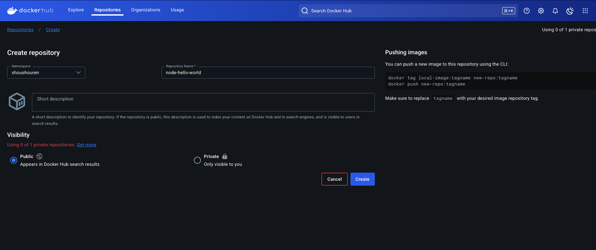
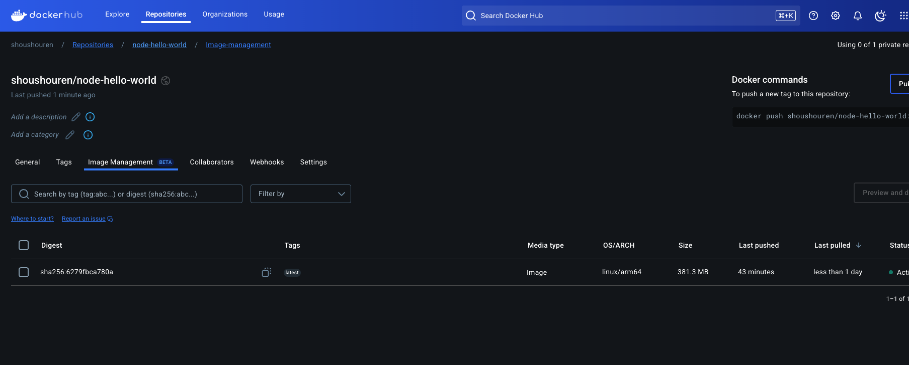

# 本篇重點

前面介紹了很多指令，在這篇會做一個統整，好讓大家需要使用到指令時，可以直接到這一篇文章查看怎麼使用，除此之外文章最後也會教大家怎麼將自己的 Docker Image 推上 Docker Hub，方便分享與部署。

<!-- more -->

## 複習 Docker 指令與參數說明

### 1. **`docker version`**

- **用途**：查看 Docker 的版本資訊。
- **範例**：
  ```bash
  docker version
  ```

---

### 2. **`docker info`**

- **用途**：查看 Docker 系統的詳細資訊，包括容器數量、映像數量、運行狀態等。
- **範例**：
  ```bash
  docker info
  ```

---

### 3. **`docker images`**

- **用途**：列出本地的 Docker 映像。
- **常用參數**：
  - `-a`：顯示所有映像（包含中間層映像）。
  - `--digests`：顯示映像的摘要資訊。
- **範例**：
  ```bash
  docker images
  docker images -a
  ```

---

### 4. **`docker ps`**

- **用途**：列出正在運行的容器。
- **常用參數**：
  - `-a`：顯示所有容器（包含已停止的）。
  - `-q`：僅顯示容器 ID。
  - `--format`：自定義輸出格式。
- **範例**：
  ```bash
  docker ps
  docker ps -a
  docker ps -q
  docker ps --format "table {{.ID}}\t{{.Names}}\t{{.Status}}"
  ```

---

### 5. **`docker run`**

- **用途**：基於指定的映像啟動一個新的容器。
- **常用參數**：
  - `-d`：以後台模式運行容器。
  - `-p`：映射主機端口到容器端口（格式：`主機端口:容器端口`）。
  - `--name`：為容器指定一個名稱。
  - `-v`：掛載主機目錄到容器內（格式：`主機目錄:容器目錄`）。
  - `-e`：設置環境變數。
- **範例**：
  ```bash
  docker run -d -p 8080:80 --name mynginx nginx
  docker run -v /home/user/data:/app/data my-node-app
  docker run -e "ENV=production" my-node-app
  ```

---

### 6. **`docker stop`**

- **用途**：停止一個或多個正在運行的容器。
- **範例**：
  ```bash
  docker stop <container_id>
  docker stop mynginx
  ```

---

### 7. **`docker rm`**

- **用途**：刪除一個或多個容器。
- **常用參數**：
  - `-f`：強制刪除正在運行的容器。
- **範例**：
  ```bash
  docker rm <container_id>
  docker rm -f mynginx
  ```

---

### 8. **`docker rmi`**

- **用途**：刪除一個或多個映像。
- **常用參數**：
  - `-f`：強制刪除映像。
- **範例**：
  ```bash
  docker rmi <image_id>
  docker rmi -f my-node-app
  ```

---

### 9. **`docker build`**

- **用途**：根據 Dockerfile 構建一個新的映像。
- **常用參數**：
  - `-t`：為映像指定名稱和標籤（格式：`name:tag`）。
  - `--no-cache`：不使用快取，重新構建映像。
- **範例**：
  ```bash
  docker build -t my-node-app:1.0 .
  docker build --no-cache -t my-node-app:latest .
  ```

---

### 10. **`docker logs`**

- **用途**：查看容器的日誌輸出。
- **常用參數**：
  - `-f`：即時追蹤日誌輸出。
  - `--tail`：顯示最後幾行日誌。
- **範例**：
  ```bash
  docker logs <container_id>
  docker logs -f mynginx
  docker logs --tail 10 mynginx
  ```

---

### 11. **`docker exec`**

- **用途**：在運行中的容器內執行命令。
- **常用參數**：
  - `-it`：以互動模式進入容器。
- **範例**：
  ```bash
  docker exec -it mynginx /bin/bash
  docker exec mynginx ls /app
  ```

---

### 12. **`docker image prune`**

- **用途**：刪除未被任何容器使用的懸空映像。
  - **懸空映像**：指的是沒有標籤（tag）且未被任何容器使用的映像。
- **常用參數**：
  - `-f`：強制刪除，不需要確認。
  - `--filter`：根據條件過濾要刪除的映像。
- **範例**：
  ```bash
  docker image prune
  docker image prune -f
  docker image prune --filter "until=24h"  # 刪除 24 小時前的懸空映像
  ```

---

### 13. **`docker image prune -a`**

- **用途**：刪除所有未被容器使用的映像（不僅限於懸空映像）。
  - 這會刪除所有未被任何容器使用的映像，包括有標籤的映像。
- **常用參數**：
  - `-f`：強制刪除，不需要確認。
  - `--filter`：根據條件過濾要刪除的映像。
- **範例**：
  ```bash
  docker image prune -a
  docker image prune -a -f
  docker image prune -a --filter "until=24h"  # 刪除 24 小時前未被使用的映像
  ```

---

## Docker Hub 是什麼？

Docker Hub 是一個公共的 Docker 雲端映像倉庫，你可以將自己構建的映像上傳到 Docker Hub，方便分享與部署，舉個比喻像是大家寫的程式碼可能都會 push 到 GitHub 或是 Gitlab，Docker 也有專屬於他的地方，有人可能會問：「為什麼不直接分享 Dockerfile？」雖然可以這麼做，但對方仍需自行編譯，而 Docker Hub 提供的是已編譯完成的映像，讓他人能直接下載並運行，省去額外的構建步驟。

### 步驟 1：註冊 Docker Hub 帳號

如果你還沒有 Docker Hub 帳號，請先到 [Docker Hub](https://hub.docker.com/) 註冊一個帳號。

---

### 步驟 2：登入 Docker Hub

在終端機中使用以下指令登入 Docker Hub：

```bash
docker login
```

輸入你的 Docker Hub 帳號和密碼。

---

### 步驟 3：在 Docker Hub 中建立一個屬於該映像的 repository

在 Docker Hub 中的 create 一個新的 repository 可以依照需求看要不要將映像公開但在 Docker Hub 上，私密映像倉庫在 Docker Hub 是有限的，如果要更多私密映像倉庫就需要付費，所以這邊鼓勵大家開源。



---

### 步驟 4：為映像打標籤

在上傳映像之前，你需要為映像打上 Docker Hub 的標籤，tag 後是要上傳的映象名稱與:tag shoushouren/node-hello-world 則是剛剛在 docker hub 建立好的 repository

```bash
docker tag my-node-app:lastest shoushouren/node-hello-world
```

---

### 步驟 5：上傳映像到 Docker Hub

使用以下指令將映像上傳到 Docker Hub ，在圖中右邊可以看到 Docker Hub 很貼心的告訴我們要怎麼推上去：



```bash
docker push shoushouren/node-hello-world
```

上傳完成後，你可以在 Docker Hub 的個人頁面中看到這個映像。

---

### 步驟 6：從 Docker Hub 拉取映像

其他人可以使用以下指令從 Docker Hub 拉取你的映像：

```bash
docker pull shoushouren/node-hello-world
```

---

## **結論**

今天我們複習了 Docker 的常用指令與參數，並學習了如何將自建的映像上傳到 Docker Hub。這些技能對於日常開發與部署非常有幫助，希望大家能夠熟練掌握。

---

# 延伸閱讀

- [Docker 官方文件 - Docker CLI](https://docs.docker.com/engine/reference/commandline/cli/)
- [Docker Hub 官方文件](https://docs.docker.com/docker-hub/)
