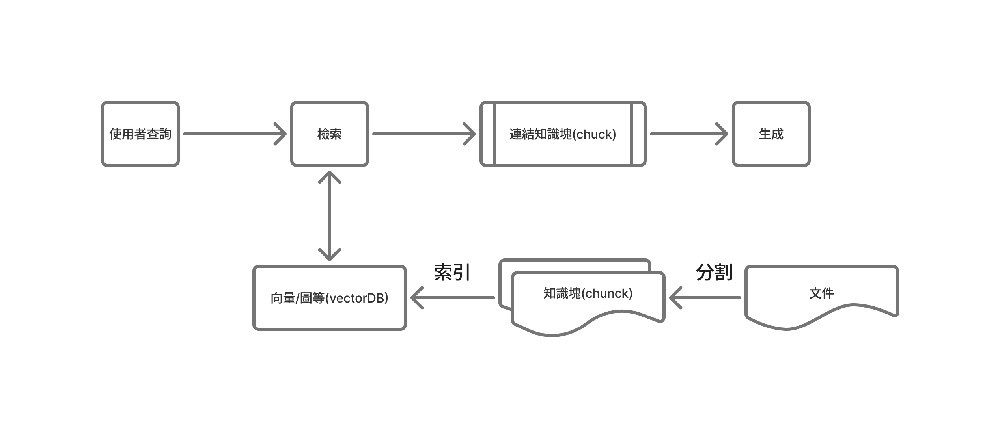

# 本篇重點

了解 RAG 應用的技術架構

<!-- more -->

## 什麼是 RAG ?

RAG 全名是 **Retrieval-Augmented Generation（檢索增強生成）**
用一段話來簡單說明一下，它不只是讓 AI「猜答案」，而是**先查資料、再回答** 的技術。
用一個例子來解說：想像你是一位學生，要回答老師的問題

### 傳統 LLM（例如 GPT）

傳統的模型就像是 **記憶力超強、但不能上網查資料的學生**。
他只能根據「以前背過的內容」來回答問題，但如果他對內容不熟悉或是涉略的相關知識不足，有時會正經的胡說八道的回答（這就是 **幻覺問題**）。

### RAG 模型

而 RAG 就像是 **考試前可以先打開書查資料的學生**。
當被問到問題時，他會先：

1. 去圖書館找出跟問題相關的幾頁資料（Retrieval）
2. 再用自己的語言組合出答案（Generation）

結果是什麼？
答案會相對**準確**、**有根據**，而不是亂猜。

## 圖解 RAG 工作流程

### 資料的索引階段

RAG 的核心在於透過「檢索（Retrieval）」來提升生成內容的品質，而其中最關鍵的部分正是**如何進行檢索**。傳統搜尋引擎或資料庫通常採用「關鍵字檢索」的方式，依據文字匹配程度來計算相關性，並產生排序後的結果。而在 RAG 應用中，我們更常使用的是**向量語意檢索（Vector Semantic Search）**，這種方法會將文本與查詢轉換為向量表示，透過計算語意上的相似度來尋找最相關的資料片段，並依照相似度高低排序，最後輸出前 _k_ 個最相關的內容區塊（top_k），這樣的語意檢索能讓模型不只找到詞彙相似的資料，更能理解語意上的關聯，從而為生成提供更準確且有意義的參考依據。

### 1. 載入：

第一步就是把要讓模型檢索的文件載入進來，這些文件可以是**結構化的資料**（像是資料表、CSV）或是**非結構化的內容**（像 PDF、Word、網站文字），基本上結構化資料處理起來會比較有效率。

---

### 2. 分割：

接下來就是要把文件「切一切」，因為直接把整份文件塞給模型是不友善的，一來太大會吃爆記憶體，二來模型根本消化不了。
所以我們要先**把文件分成比較小的區塊（chunk）**，讓後續檢索更精準，這個概念就像你不會一次把一頭豬吃下去，不然你一定被噎死，或根本吸收不了，資料也是一樣，要切成適合的大小才能好好被「消化」。

而分割的規則也有很多種，比如可以根據**段落、標題、句號**這些標記來切，確保每一塊都能保有完整的語意。

---

### 3. 嵌入（Embedding）：

當你把資料切成一塊一塊之後，模型還是看不懂這些文字，因為它不是人，這時就要進行「嵌入」這個動作，也就是把文字轉成**高維度的向量**，這些向量就像是資料在數學空間裡的座標點，讓模型能夠「用距離」去理解哪兩段文字在意思上比較接近，我們可以用一些常見的 embedding 模型來輔助我們開發，像是 **OpenAI 的 `text-embedding-3-small`**，它會幫我們把每一塊文字轉成幾百維的向量，方便後續比對。

---

### 4. 索引：

最後就是要幫這些向量建立索引，也就是把它們丟進向量資料庫裡，像是 **Pinecone、FAISS、Weaviate、Chroma** 等等，有了索引之後，當使用者提問時，系統就能拿問題的向量去跟資料庫裡的那些知識塊比相似度（像用餘弦相似度算距離），然後找出最相關的前幾個結果（Top-k），然後這些被找出來的內容，後面就會交給語言模型去組合成最終的回答。

---

### 5. 檢索前處理：

在正式檢索之前，我們通常會對使用者輸入的問題做一些**前處理（Pre-processing）**。
像是：

- 清理多餘符號或格式
- 做斷詞、去停用詞（stop words）
- 調整問句結構讓它更清楚
- 甚至可以用模型先改寫（rephrase）問題，讓檢索效果更好

這一步就有點像是「幫助模型更聽得懂人話」。
處理得好，檢索的準確度會差很多，尤其是在多語言或口語化輸入的情況下。

---

### 6. 檢索：

當使用者輸入一個問題時，我們會先把這個問題一樣轉成向量，然後去**向量資料庫裡找出語意最接近的內容區塊**，這個動作就是「檢索」，簡單說，就是讓問題的向量去對比向量資料庫的資料，找到那些跟它意思最像的知識塊，背後是用到**餘弦相似度（Cosine Similarity）**這種演算法，幫我們算出每個資料的相關程度，然後取出最相關的前幾個結果（Top-k），這些被挑出來的內容，就會被拿去給模型作為參考資料，幫助它生成更準確的回答。

---

### 8. 檢索後處理：

再來是**檢索後處理（Post-processing）**。
這階段的目標是讓最終的生成結果更乾淨、更符合需求
常見的做法有：

- 將檢索到的內容進行去重、過濾無關段落
- 依照內容重要性重新排序
- 過濾掉重複或衝突的資訊
- 在輸出時加上來源引用（citation），提升可信度

有些應用甚至會在這一步做「答案驗證（Answer Validation）」或「事實檢查（Fact Checking）」，避免模型亂講。
整體來說，這一步是讓 RAG 系統更像一個專業助手，不只找資料、還會幫你整理出乾淨又可靠的結果。

---

### 7. 生成：

有了檢索到的內容後，接下來就是**生成（Generation）**，這個步驟就是讓語言模型去根據剛剛找回來的資料，再加上使用者的問題，生成一個有條理又自然的回答，
你可以想成：模型就像一個很會整理資料的助理，會先讀完那幾段最相關的文件，然後用自己的語言把答案「重組」出來，這樣的好處是模型不是亂掰的，而是根據實際的內容來回答，**內容的可解釋性跟可靠度會有相對的提升**。

---
